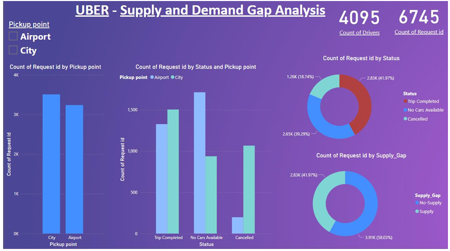
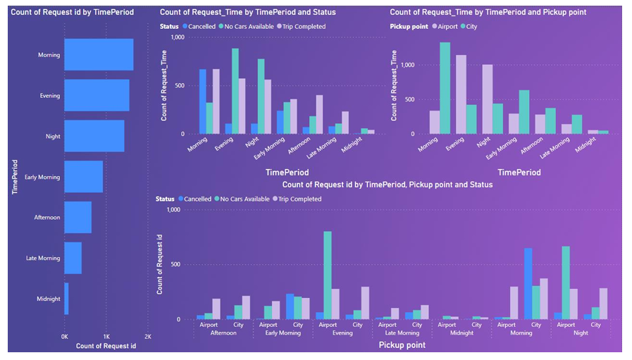

# Uber Supply & Demand Gap Analysis

Power BI analysis of Uber ride-request data to identify **supply-demand gaps across pickup locations, request status, and time periods**.

## Project Overview

This project analyzes Uber ride requests to understand when and where customer demand exceeds available driver supply.

The analysis focuses on:

- request volume by pickup point
- completed, cancelled, and unavailable requests
- supply versus no-supply
- demand patterns across different time periods
- differences between City and Airport requests
- periods associated with high cancellations or car unavailability

## Dashboard



### Key Dashboard Metrics

| Metric | Value |
|---|---:|
| Total Requests | 6,745 |
| Driver count shown on dashboard | 4,095 |
| Supply / Successful Trips | 41.97% |
| No-Supply | 58.03% |

In the analysis, **Supply** represents successful/completed trips, while **No-Supply** combines cancelled requests and requests for which no cars were available.

## Dataset

The dataset contains the following main fields:

- Request ID
- Pickup Point
- Status
- Driver ID
- Request Timestamp
- Drop Timestamp

The analysis also created derived fields to support time-based and supply-gap analysis:

- **Request Time**
- **Time Period**
- **Supply Gap**

The `Time Period` field groups requests into periods such as Morning, Afternoon, Evening, and Night.

## Data Preparation

The project workflow included:

1. Importing the Uber request dataset into Power BI Desktop
2. Checking and preprocessing the data
3. Handling missing, duplicate, and error values where appropriate
4. Creating derived fields for time-based analysis
5. Creating the Supply Gap classification
6. Building interactive Power BI visualizations
7. Analyzing patterns and identifying supply-demand gaps

Some missing values are meaningful within the dataset. For example, Driver ID can be missing when no car is available, while Drop Timestamp can be missing for cancelled requests or requests where no car was available.

## Supply & Demand Analysis

The dashboard indicates that approximately **41.97%** of requests resulted in supply/successful trips, while approximately **58.03%** were classified as no-supply.

The request-status analysis shows approximately:

- **42% completed trips**
- **39% no cars available**
- **18% cancelled requests**

## Pickup-Point Analysis

The analysis identified different supply-demand problems at the two pickup locations:

- overall request volume was higher in the **City** than at the Airport
- **No Cars Available** occurred more frequently at the **Airport**
- **Cancelled** requests occurred more frequently in the **City**

## Time-Period Analysis



The time-based analysis identified two important demand periods:

- **Morning:** high City demand, with a notable cancellation problem
- **Evening:** high Airport demand, with a notable shortage of available cars

The analysis also found that finding a car was more difficult during Evening/Night at the Airport and during Morning in the City.

## Key Insights

### 1. Morning City Gap

Morning demand is high in the City, while cancellations are also high.

This contributes to a supply-demand gap during the morning period.

### 2. Evening Airport Gap

Evening demand is high at the Airport, while the number of requests with **No Cars Available** is also high.

This indicates an important supply shortage at the Airport during high-demand periods.

### 3. Overall Supply Gap

Successful trips account for less than half of the requests in the analyzed dataset, indicating a substantial gap between requested rides and fulfilled rides.

## Recommendations

Based on the documented analysis:

- increase driver availability during high-demand periods
- improve driver supply around the Airport during Evening demand
- consider incentives during peak periods
- address the high cancellation pattern associated with Morning City requests
- improve driver positioning between City and Airport based on time-dependent demand

## Tools & Skills

- **Power BI**
- Data Cleaning
- Data Transformation
- Data Visualization
- Dashboard Development
- Exploratory Data Analysis
- Time-Based Analysis
- Business Analysis
- Supply-Demand Analysis

## Repository Structure

```text
Supply-and-Demand-Gap-Analysis/
├── README.md
├── images/
│   ├── uber_supply_demand_dashboard.png
│   └── uber_time_period_analysis.png
├── data/
│   └── uber_request_data.csv
├── powerbi/
│   └── supply_demand_gap_analysis.pbix
└── docs/
    └── supply_demand_gap_analysis_report.pdf
```

## Project Files

- `powerbi/supply_demand_gap_analysis.pbix` — editable Power BI project
- `data/uber_request_data.csv` — source dataset used for the analysis
- `docs/supply_demand_gap_analysis_report.pdf` — project report
- `images/` — selected dashboard visuals for quick portfolio review

## Scope

This repository presents a portfolio version of the Power BI analysis based on the supplied Uber request dataset.

The findings and recommendations represent insights from the analyzed dataset and should not be interpreted as statements about Uber's current operations.
